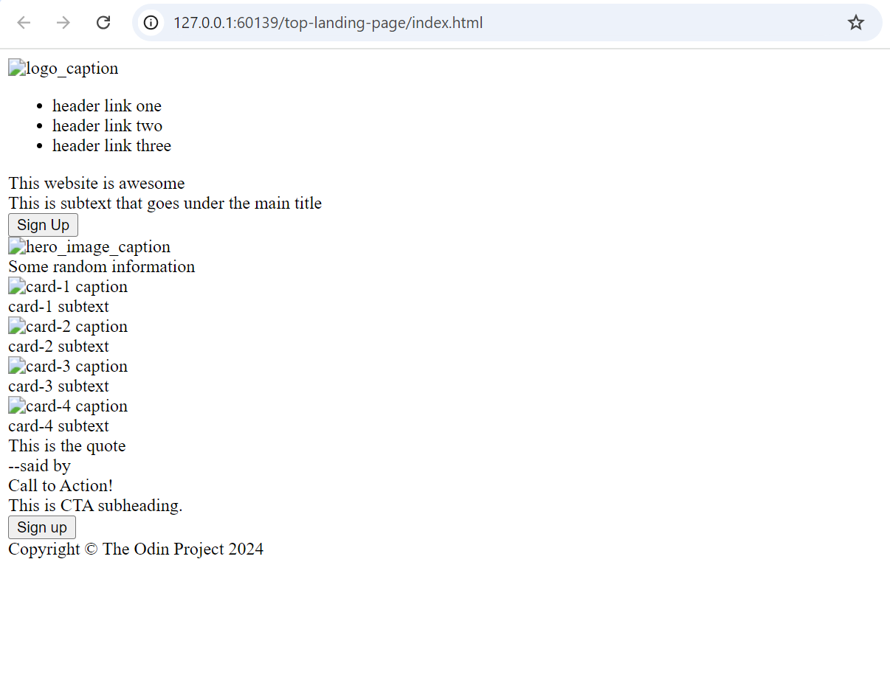
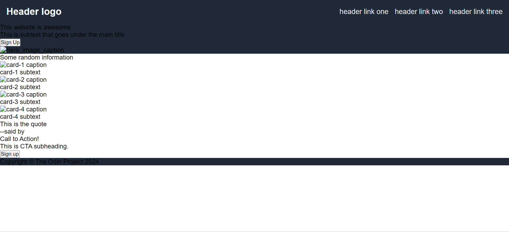
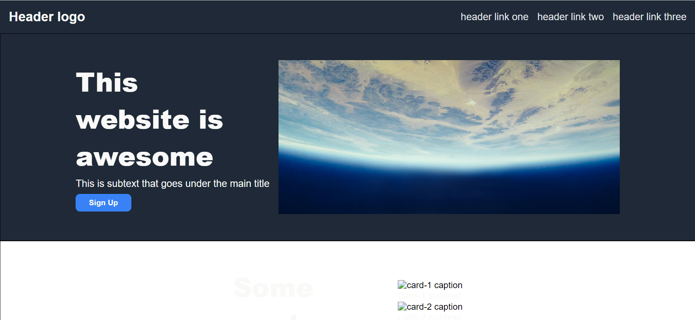
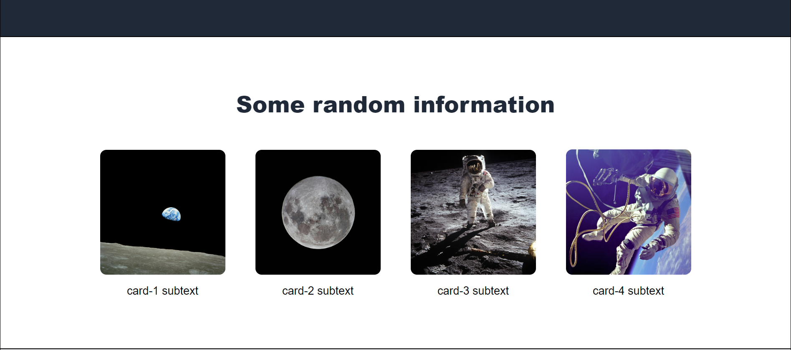
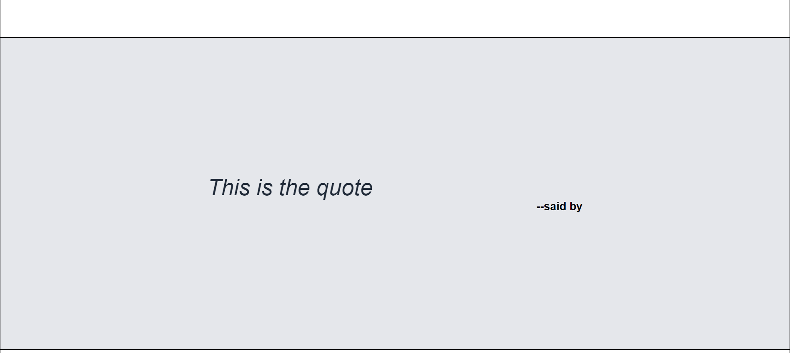
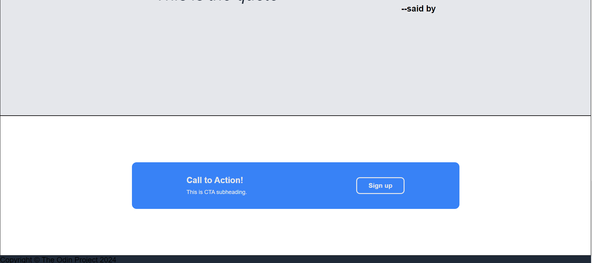

### About this project
This project is part of The Odin Project's Flexbox Section completion project, named "Landing Page".
The aim is to re-create a webpage based on the images provided in the /Ref directory.

### 1. Creating a skeleton first
I have created the html skeleton based on the reference image. Check the relevant version of the index.html file.

You will see the address bar has some local ip-address like thing. That's because I'm using a ==VScode extension named Live Server (55M+ downloads)==. When you right click on your index.html file and open it with Live Server, it updates the changes in realtime as you save your edits. No need to refresh the browser. Though I didn't use it much to check my html skeleton because I knew the render is going to flow normally and the containers are going to stack on one another. But this Live Server will be tremendously helpful in applying CSS. Most of my CSS exercises benefitted from having the Live Server and text-editor and browser window side-by-side.

### 2. Beginning styling header first
Read the relevant commit message for detailed description.
But the idea is to focus only on the dedicated element styling.
Demarcate its styling using a comment so that it becomes easy to navigate.

This is how it looks at this stage:

### 3. Container one styling complete
This is how the webpage looks like at the moment.
Once all containers are styled, I will work on the copy.

### Containers two and three styling complete

### Container four styling complete

